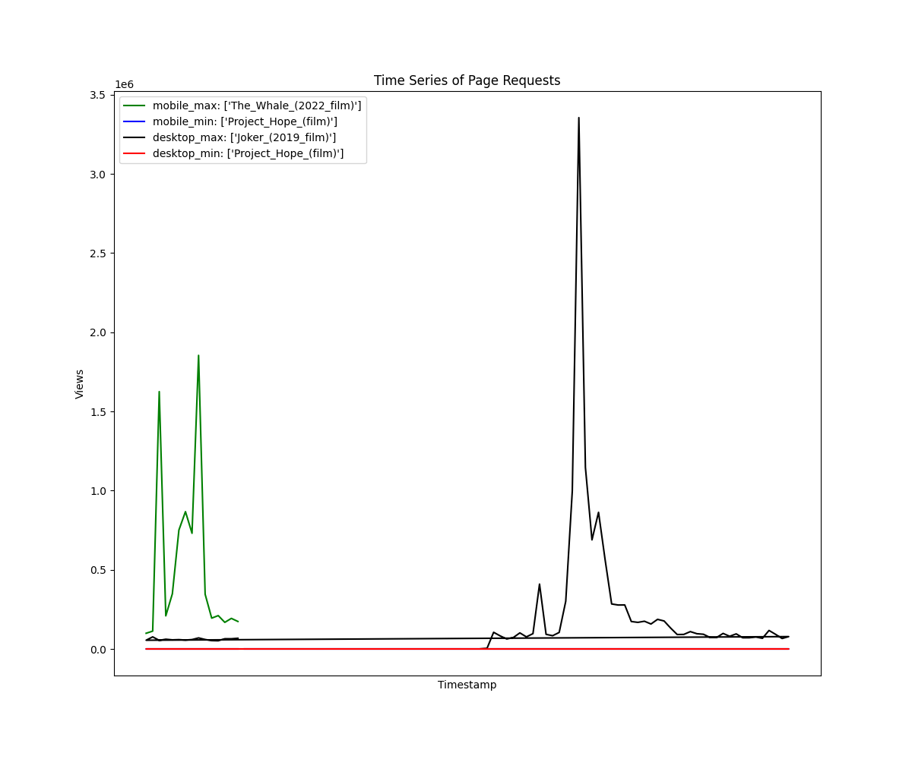
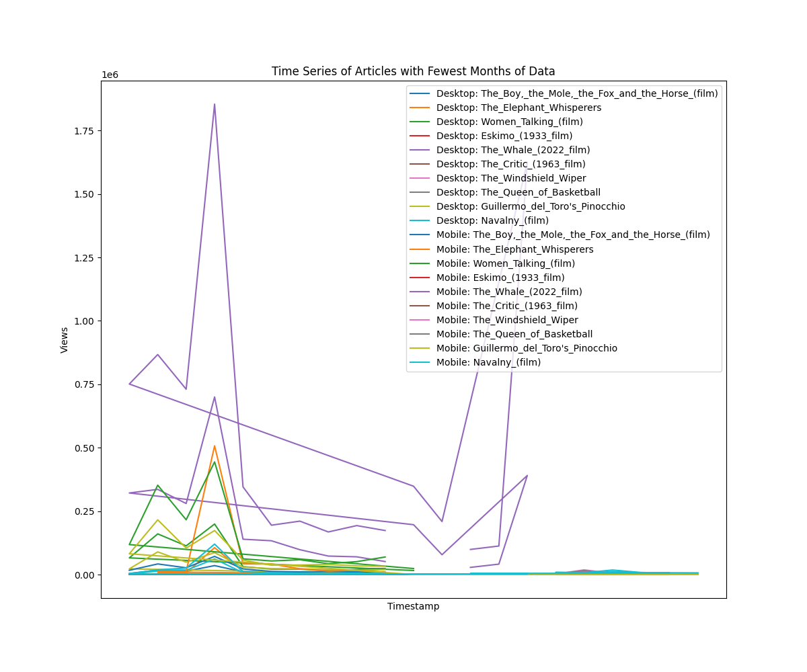

# DATA 512: Human Centered Data Science

## Summary:
The goal of this assignment is to construct, analyze, and publish a dataset of monthly article traffic for a select set of pages from English Wikipedia from July 1, 2015 through September 30, 2023. The primary focus is on incorporating the best practices for reproducibility and openness, as outlined in "[Assessing Reproducibility](http://www.practicereproducibleresearch.org/core-chapters/2-assessment.html)" and "[The Basic Reproducible Workflow Template](http://www.practicereproducibleresearch.org/core-chapters/3-basic.html)". 

## Data Source:
To gather the necessary data, the project utilizes the Pageviews Wikipedia API to make requests for pageview counts. The API endpoint and documentation are provided below. The Pageviews API (documentation, endpoint) provides access to desktop, mobile web, and mobile app traffic data from July 2015 through the previous complete month.
1. [Pageviews API](https://wikimedia.org/api/rest_v1/#/Pageviews_data/get_metrics_pageviews_aggregate_project_access_agent_granularity_start_end)
2. [Pageviews Documentation](https://wikitech.wikimedia.org/wiki/Analytics/AQS/Pageviews)
* [Wikimedia Foundation REST API terms of use](https://www.mediawiki.org/wiki/API:REST_API#Terms_and_conditions)

We use the PageviewsAPI to extract subsets of data and store the intermediate data files in the "data folder". Post acquisition of the data, analysis has been performed and corresponding plots are saved under the "images" directory. 

## Required Libraries:
- matplotlib
- urllib
- requests
- json
- time

## Repository Structure:
- Root
  - code
    - hcds_data_acquisition_analysis.ipynb
  - data
    - academy_monthly_cumulative_201507-202309.json
    - academy_monthly_desktop_201507-202309.json
    - academy_monthly_mobile_201507-202309.json
    - thank_the_academy.AUG.2023.csv.xlsx
  - images
    - fewest_months_data.png
    - min_max_avg.png
    - top_10_peak_page_views.png
  - LICENSE
  - README.md

## Description
1. code : This directory contains the code file : hcds_data_acquisition_analysis.ipynb for data acquistion, generating intermediate data files and analysing them
2. data : The data directory stores data files used for analysis. It includes JSON files (academy_monthly_cumulative_201507-202309.json, academy_monthly_desktop_201507-202309.json, academy_monthly_mobile_201507-202309.json) and an Excel file (thank_the_academy.AUG.2023.csv.xlsx) which contains the list of articles for which the json data has to be fetched.
3. images : This directory stores the graphs produced after performing data analysis
4. LICENSE : This file contains the licensing information about the project - MIT License
5. README.md : Provides an overview of project, data sources, instructions for use and general structure of the repository. 

## Results 

## Usage
1. Clone the repository to your local machine.
2. Ensure you have the required dependencies installed, see Required libraries.
3. Replace any data files path with your local path.
4. Run the provided Python script.

